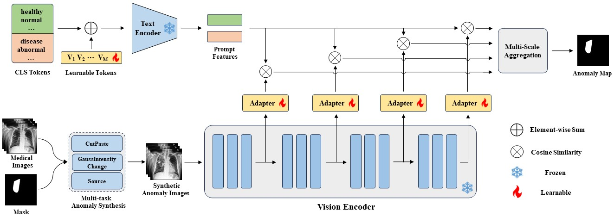
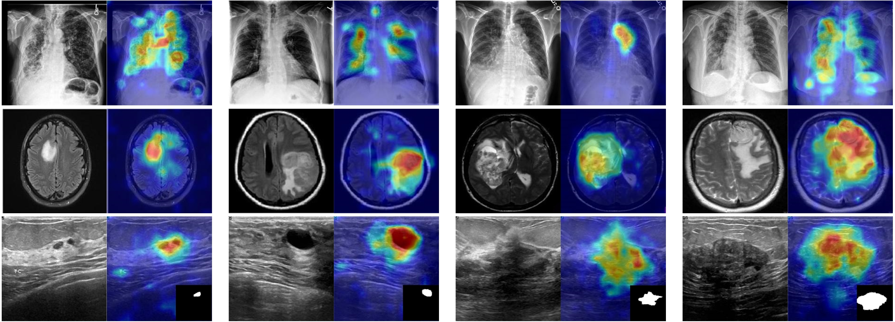

# MediCLIP

**💡 This is the official implementation of the paper "MediCLIP: Adapting CLIP for Few-shot Medical Image Anomaly Detection"(MICCAI 2024) [[arxiv]](https://arxiv.org/abs/2405.11315)**.  

MediCLIP is an efficient few-shot medical image anomaly detection method, demonstrating SOTA anomaly detection performance with very few normal medical images. MediCLIP integrates learnable prompts, adapters, and realistic medical image anomaly synthesis tasks.
   
  
<div align=center></div>  

## 🔧 Installation

To run experiments, first clone the repository and install `requirements.txt`.

```
$ git clone https://github.com/cnulab/MediCLIP.git
$ cd MediCLIP
$ pip install -r requirements.txt
```  
### Data preparation 
Download the following datasets:
- **BUSI  [[Baidu Cloud (pwd8866)]](https://pan.baidu.com/s/1EVt96fExiqrvMQslPDRRRg?pwd=8866)   [[Google Drive]](https://drive.google.com/file/d/1PyvMXdNEVY86BY1PV8yKhPVS30TAmS6X/view?usp=drive_link)  [[Official Link]](https://scholar.cu.edu.eg/?q=afahmy/pages/dataset)**  
- **BrainMRI  [[Baidu Cloud (pwd8866)]](https://pan.baidu.com/s/1--5vPMN-eTqePPYjpKTwvA?pwd=8866)  [[Google Drive]](https://drive.google.com/file/d/1kldE-5_wXaN-JR_8Y_mRCKQ6VZiyv3km/view?usp=drive_link)  [[Official Link]](https://www.kaggle.com/datasets/navoneel/brain-mri-images-for-brain-tumor-detection)**  
- **CheXpert [[Baidu Cloud (pwd8866)]](https://pan.baidu.com/s/15-V5wobA_7ICvZAXBraDGA?pwd=8866)  [[Google Drive]](https://drive.google.com/file/d/1pVYRipGC2VqjYP-wHdDFR-lLf7itLiUi/view?usp=drive_link)  [[Official Link]](https://stanfordmlgroup.github.io/competitions/chexpert/)**  

Unzip them to the `data`. Please refer to [data/README](data/README.md).  
  
## 🚀 Experiments

To train the MediCLIP on the BrainMRI dataset with the support set size is 16:  
```
$ python  train.py --config_path config/brainmri.yaml  --k_shot 16
```  
   
To test the MediCLIP on the BrainMRI dataset:  
```
$ python  test.py --config_path config/brainmri.yaml  --checkpoint_path xxx.pkl
```  
Replace ``xxx.pkl`` with your checkpoint path.
<div align=center></div>  

---
Code reference: **[[CLIP]](https://github.com/OpenAI/CLIP)**  **[[CoOp]](https://github.com/KaiyangZhou/CoOp)**  **[[Many-Tasks-Make-Light-Work]](https://github.com/matt-baugh/many-tasks-make-light-work)**.


## 🔗 Citation  

If this work is helpful to you, please cite it as:
```
@inproceedings{zhang2024mediclip,
      title={MediCLIP: Adapting CLIP for Few-shot Medical Image Anomaly Detection}, 
      author={Ximiao Zhang, Min Xu, Dehui Qiu, Ruixin Yan, Ning Lang, and Xiuzhuang Zhou},
      year={2024},
      eprint={2405.11315},
      archivePrefix={arXiv},
      primaryClass={cs.CV}
}
```
